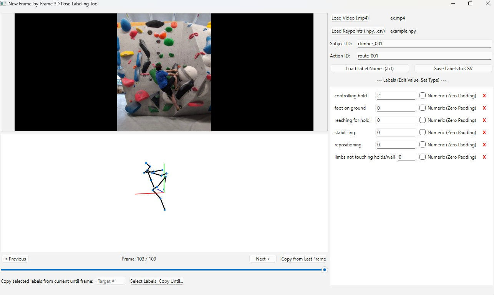

# Labelling-machine: A Tool for 3D Human Pose Action Annotation
 
A Python-based graphical user interface for efficient labeling and annotation of 3D human pose action data, typically obtained from motion capture or pose estimation systems.


## Summary

This tool introduces a new human pose action annotation framework designed for researchers with an interactive tool to visualize 3D key point data alongside corresponding video footage (optional) and assign categorical or numerical labels over time. It offers two distinct methods to accommodate different annotation workflows. Frame-by-frame annotation allows users to assign a specific value to each label for every single frame or to label actions or attributes that occur over specific time intervals (e.g. labelling “walking from frame 10 to 50).

The tool facilitates the creation of rich datasets for machine learning research in areas like action recognition, biomechanics, and human-computer interaction. Labelled data, including original keypoints and user-defined annotations, can be exported to a structured CSV format.
## Statement of Need

The analysis of 3D human motion is a useful tool to a variety of research fields, including biomechanics, sports science, robotics, and human-computer interaction [^1]. The increasing availability of computing power and utility has led to an increased number of models that make use of the available complex 3D key point datasets. (e.g., Human3.6M [^2], AMASS [^3], Halpe [^4]). However, the raw 3D coordinate output from these models is often not immediately useful for downstream tasks such as action recognition, motion analysis, or training machine learning models. A critical and often laborious step is the annotation of this data, where specific actions, phases of movement, or events are assigned to corresponding sequences of frames.

Manually annotating 3D pose data is a cumbersome and time-consuming process. Researchers often resort to using video editing software to segment action sequences before processing them through a pose estimation model. This workflow is inefficient, prone to synchronization errors between the video and the 3D data, and may require the use of proprietary, paid software. Furthermore, managing and labelling long sequences with multiple, complex actions (e.g., different phases of a climbing movement) by cross-referencing video playback, 3D pose output, and a separate annotation file is a significant bottleneck. This manual process is not only inefficient but also scales poorly as dataset sizes increase, hindering the pace of research that relies on richly annotated 3D motion data.

Several annotation tools are available, though many are not specialized for the specific challenges of 3D human pose data. General-purpose, open-source tools like CVAT (Computer Vision Annotation Tool) [^5] are powerful for 2D video and image labelling but lack the integrated, interactive 3D skeleton visualization that is crucial for accurately contextualizing and annotating motion. While it has some 3D capabilities for point clouds, its primary interface is not designed for the fluid, frame-by-frame analysis of skeletal key point data. On the other end of the spectrum, commercial platforms such as Labelbox [^6] offer sophisticated, enterprise-focused solutions with support for various 3D data types. However, their proprietary nature and cost can be prohibitive for academic research, and they may lack the flexibility for tailored, research-specific workflows. The open-source 3D creation suite Blender [^7] is highly versatile and can be adapted for motion annotation, but this requires considerable technical expertise to script and configure a suitable pipeline, presenting a steep learning curve for those who simply need a ready-to-use annotation tool. Our tool fills the gap left by these solutions by providing a focused, open-source, and out-of-the-box application that tightly integrates 3D pose visualization, synchronized video, and a straightforward labelling interface, directly addressing the workflow bottlenecks in 3D human motion research.

There is a clear need for an open-source tool that streamlines this annotation process. Such a tool should integrate 3D pose visualization, synchronized video playback, and a flexible labelling interface into a single platform. This integration would allow for the rapid and accurate creation of high-quality, labelled datasets. Our tool is designed to meet this need by providing an interactive and user-friendly solution that supports both interval-based and frame-by-frame annotation, thereby accelerating research that depends on detailed 3D human pose analysis.
## Installation

*(Ensure you have Python 3.8+ installed, The project was realised using Python 3.10)*

1.  **Clone the repository:**
    ```bash
    git clone [https://github.com/CrisTTT/labeling_machine](https://github.com/CrisTTT/labeling_machine)
    cd labeling_machine
    ```
2.  **Create and activate a virtual environment (Recommended):**
    ```bash
    # Using venv
    python -m venv .venv
    source .venv/bin/activate  # On Linux/macOS
    # .venv\Scripts\activate  # On Windows

    # Or using conda
    # conda create -n poselabeler python=3.10 # Or your preferred Python version
    # conda activate poselabeler
    ```

3.  **Install dependencies:**
    ```bash
    pip install -r requirements.txt
    # Or, if using pyproject.toml with setuptools/hatch/etc.
    # pip install .
    ```
## Usage

1.  **Launch the application:**
    From the project's root directory (where `main.py` is located), run:
    ```bash
    python main.py
    ```

2.  **Load Data:**
    * Use the "Load Keypoints" button to select your 3D keypoint data file (supports `.npy` or `.csv` formats). The data should typically be structured as `(num_frames, num_keypoints, 3)` Currently, the format is set to 17 keypoint HALPE.
    * For other formats such as MS-COCO, please find "self.limbSeq" in classic interface or new interface and modify the limb sequence accordingly.
    * Optionally, use the "Load Video" button to load a corresponding video file (`.mp4`). Ensure the video frame count matches the keypoint data frame count for proper synchronization.
    * Use the "Load Label Names" button to load a comma-separated list of label categories from a `.txt` file (e.g., `action, phase, contact`).

3.  **Navigate and Label:**
    * **3D View:** Rotate the view by clicking and dragging with the left mouse button. Zoom using the mouse wheel.
    * **Frame Navigation:**
        *  Use the slider to navigate between frames.
        *  Use the "Previous" and "Next" buttons or the slider to move frame by frame.
    * **Labeling (Classic):**
        * Click "Add New Label Type" or load names.
        * For each label type, click "Add Value/Category".
        * For each value, click "Add Interval" and specify the start and end frames.
    * **Labeling (New):**
        * Load label names. Each label will appear with an input field.
        * Navigate to the desired frame.
        * Enter the appropriate value for each label in its text box for that frame. Check the "Numeric (Zero Padding)" box if the label should be treated as a number (and will default to 0 if no value is assigned in the CSV for that frame).
        * Use the "Copy from Last Frame" button to duplicate the previous frame's labels to the current frame.
        * Delete unwanted label types using the "X" button next to the label name.

4.  **Save Labels:**
    * Enter appropriate "Subject ID" and "Action ID" (or other relevant identifiers).
    * Click the "Save Labels to CSV" button. This will save the keypoint data along with all assigned labels for every frame into a CSV file. The filename will typically be based on the input keypoint filename.

## Features

* Interactive 3D pose visualization using PyOpenGL.
* Optional synchronized video playback using OpenCV.
* Two distinct labeling modes: interval-based (Classic) and frame-by-frame (New).
* Support for loading keypoints from `.npy` and `.csv` files.
* Support for loading predefined label names from `.txt` files.
* Frame-by-frame navigation with slider and buttons.
* Functionality to copy labels from the previous frame (New Interface).
* Functionality to delete label types from the interface (New Interface).
* Export of labeled data (keypoints + annotations) to CSV format.

** Cross-platform (developed on Windows and macOS 14/15 with Apple Silicon). Latest version not tested on macOS or Linux.
** Currently not tested and not built with the scope of having multiple subjects.

### Provided Functionality: 


Our labelling tool offers an interactive graphical interface for efficient annotation of 3D human pose data. The core functionality is centred around a unified workspace that combines an interactive 3D skeleton visualisation using OpenGL and synchronized video playback.

The software supports loading 3D key point data from both .npy and .csv files and allows label categories to be pre-defined and loaded from a .txt file. There are two ways to annotate that we provide. The interval-based annotation where labels can be assigned to a specific range of frames and there is a frame-by-frame annotation method. In the frame-by-frame annotation method a unique value for each label can be assigned for every single frame.

Convenience features have also been implemented to help the user label data more easily and faster. These features include the option to copy the labels from the previous frame, dynamically handling labels, a slider and frame stopping buttons can be used for navigation between frames, and an “autosave” functionality. The tool exports the original key point data along with all user-defined labels into a single .csv file which is immediately ready to be used in machine learning or data analysis pipelines. 


## Contributing

Contributions are welcome! 


## License

This project is licensed under the terms of the [MIT License](LICENSE.txt).

## References

[^1]:
Wang, J., et al. (2021). Deep 3D human pose estimation: A review. Computer Vision and Image Understanding, 210, 103225. https://doi.org/10.1016/j.cviu.2021.103225

[^2]:
Ionescu, C., et al. (2014). Human3.6M: Large Scale Datasets and Predictive Methods for 3D Human Sensing in Natural Environments. IEEE Transactions on Pattern Analysis and Machine Intelligence, 36(7), 1325-1339.

[^3]:
Mahmood, N., et al. (2019). AMASS: Archive of Motion Capture as Surface Shapes. In International Conference on Computer Vision (ICCV) (pp. 5442-5451).

[^4]:
Fang, H-S., et al. (2022). AlphaPose: Whole-Body Regional Multi-Person Pose Estimation and Tracking in Real-Time. IEEE Transactions on Pattern Analysis and Machine Intelligence.

[^5]:
CVAT.ai Corporation. (2023). Computer Vision Annotation Tool (CVAT). https://cvat.ai/

[^6]:
Labelbox, Inc. (2025). Labelbox: The Data Engine for AI. Retrieved July 15, 2025, from https://labelbox.com/

[^7]:
Blender Foundation. (2025). Blender - a 3D modelling and rendering package. Retrieved July 15, 2025, from https://www.blender.org/