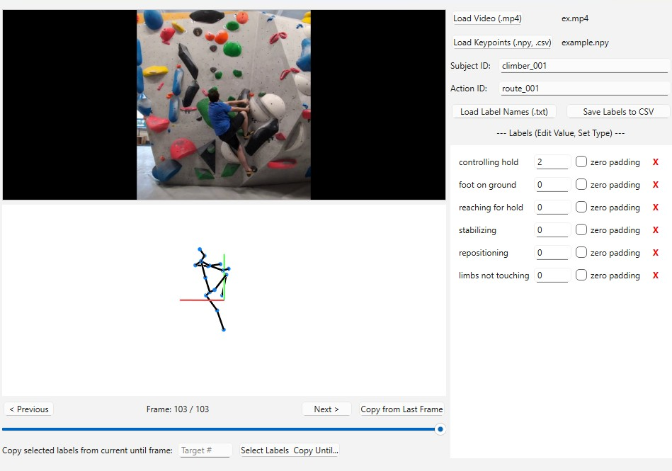

# Labelling-machine: A Tool for 3D Human Pose Action Annotation
 
A Python-based graphical user interface for efficient labeling and annotation of 3D human pose action data, typically obtained from motion capture or pose estimation systems.


## Summary

This paper introduces a new human pose action annotation framework designed for researchers with an interactive tool to visualize 3D keypoint data alongside corresponding video footage (optional) and assign categorical or numerical labels over time. It offers two distinct methods to accommodate different annotation workflows. Frame-by-frame annotation allows users to assign a specific value to each label for every single frame or to label actions or attributes that occur over specific time intervals (e.g., labelling “walking” from frame 10 to 50).

This tool facilitates labelling action data. The user-defined annotations and original keypoint data are exported to a ready-to-use structured .csv format.

***

## Statement of Need

The analysis of 3D human motion is a useful tool for a variety of research fields, including biomechanics, sports science, robotics, and human-computer interaction [^1]. The increasing availability of computing power and use of 3D human pose estimation has led to an increased number of models that make use of the available complex 3D keypoint datasets (e.g., Human3.6M [^2], AMASS [^3], Halpe [^4]). However, the raw 3D joint coordinate output from these models can be augmented by also having aside labeled actions for downstream tasks such as action recognition, motion analysis, or training machine learning models. A critical and often laborious step is the annotation of this data, where specific actions, phases of movement, or events are assigned to corresponding sequences of frames.

Manually annotating 3D pose action data is a cumbersome and time-consuming process. Researchers often resort to using video editing software to segment action sequences before processing them through a pose estimation model. This workflow is inefficient, prone to synchronization errors between the video and the 3D data, and may require the use of proprietary, paid software. Furthermore, managing and labelling long sequences with multiple, complex actions (e.g., different phases of a climbing movement) by cross-referencing video playback, 3D pose output, and a separate annotation file is a significant bottleneck. This manual process is not only inefficient but also scales poorly as dataset sizes increase, hindering the pace of research that relies on richly annotated 3D motion data.

Several annotation tools are available, though many are not specialized for the specific challenges of 3D human pose data. General-purpose, open-source tools like CVAT (Computer Vision Annotation Tool) [^5] are powerful for 2D video and image labelling but lack the integrated, interactive 3D skeleton visualization that is crucial for accurately contextualizing and annotating motion. While it has some 3D capabilities for point clouds, its primary interface is not designed for the fluid, frame-by-frame analysis of skeletal keypoint data. On the other end of the spectrum, commercial platforms such as Labelbox [^6] offer sophisticated, enterprise-focused solutions with support for various 3D data types. However, their proprietary nature and cost can be prohibitive for academic research, and they may lack the flexibility for tailored, research-specific workflows. The open-source 3D creation suite Blender [^7] is highly versatile and can be adapted for motion annotation, but this requires considerable technical expertise to script and configure a suitable pipeline, presenting a steep learning curve for those who simply need a ready-to-use annotation tool. Our tool fills the gap left by these solutions by providing a focused, open-source, and out-of-the-box application that tightly integrates 3D pose visualization, synchronized video, and a straightforward labelling interface, directly addressing the workflow bottlenecks in 3D human motion research.

There is a clear need for an open-source tool that streamlines this annotation process. Such a tool should integrate 3D pose visualization, synchronized video playback, and a flexible labelling interface into a single platform. This integration would allow for the rapid and accurate creation of high-quality, labelled datasets. Our tool is designed to meet this need by providing an interactive and user-friendly solution that supports both interval-based and frame-by-frame annotation, thereby accelerating research that depends on detailed 3D human pose analysis.

***

## Installation

*(Ensure you have Python 3.8+ installed. The project was developed using Python 3.10)*

1.  **Clone the repository:**
    ```bash
    git clone [https://github.com/CrisTTT/labeling_machine](https://github.com/CrisTTT/labeling_machine)
    cd labeling_machine
    ```
2.  **Create and activate a virtual environment (Recommended):**
    ```bash
    # Using venv
    python -m venv .venv
    source .venv/bin/activate  # On Linux/macOS
    # .venv\Scripts\activate  # On Windows

    # Or using conda
    # conda create -n poselabeler python=3.10
    # conda activate poselabeler
    ```

3.  **Install dependencies:**
    ```bash
    pip install -r requirements.txt
    ```

***

## Usage

1.  **Launch the application:**
    From the project's root directory (where `main.py` is located), run:
    ```bash
    python main.py
    ```

2.  **Load Data:**
    * **Load Keypoints:** Use the button to select your 3D keypoint data file (`.npy` or `.csv`). The data should be structured as `(num_frames, num_keypoints, 3)`. The default format is 17 keypoint HALPE. For other formats, you may need to modify the limb sequence in the application's code.
    * **Load Video (Optional):** Use the button to load a corresponding video file (`.mp4`). Ensure the video's frame count matches the keypoint data for proper synchronization.
    * **Load Label Names:** Use the button to load a comma-separated list of label categories from a `.txt` file (e.g., `action,phase,contact`).

3.  **Navigate and Label:**
    This unified interface allows you to navigate your 3D animation and apply labels efficiently.

    #### Navigating the Scene

    * **3D View Controls:**
        * **Rotate:** Click and drag with the left mouse button.
        * **Pan:** Click and drag with the right mouse button.
        * **Zoom:** Use the mouse scroll wheel.
    * **Frame Navigation:**
        * **Scrub:** Drag the timeline slider to quickly move through the animation.
        * **Step Frame-by-Frame:** Use the `Previous` and `Next` buttons, or press the `Left` and `Right` arrow keys on your keyboard for precise control.

    #### Labeling Your Animation

    The labeling process is designed to be flexible, allowing you to annotate individual frames or entire intervals.

    1.  **Load Label Categories:**
        * Click the **"Load Label Names (.txt)"** button.
        * Select a `.txt` file where each label name is separated by a comma (e.g., `is_walking,hand_raised,object_interaction`).
        * Each label will appear with its own input field.

    2.  **Annotate Frames:**
        * Navigate to the desired start frame of an action.
        * Enter the appropriate value for each label in its corresponding text box.
        * **Zero Padding:** Check the "Zero Padding" box if a label's value is numerical. This ensures that any frame without an explicit label will default to `0` in the final output, preventing empty cells in your CSV.
        * **Copy from Last Frame:** Use this button to quickly duplicate the labels from the previous frame, which is useful for continuous actions.

    3.  **Create Label Intervals (Optional):**
        * For labels that persist over multiple frames, you can define an interval.
        * After entering a value for a label, click **"Add Interval"**.
        * Specify the `Start Frame` and `End Frame` for which the value is valid.

    4.  **Manage Labels:**
        * To remove a label category entirely, click the **`X`** button next to its name.

4.  **Save Labels:**
    * Enter an appropriate **"Subject ID"** and **"Action ID"** (or other relevant identifiers).
    * Click the **"Save Labels to CSV"** button. This will save the keypoint data along with all assigned labels for every frame into a single CSV file.

***

## Features

* Interactive 3D pose visualization using PyOpenGL.
* Optional synchronized video playback using OpenCV.
* Flexible labeling that supports both interval-based and frame-by-frame annotation.
* Support for loading keypoints from `.npy` and `.csv` files.
* Support for loading predefined label names from `.txt` files.
* Frame-by-frame navigation with a timeline slider and buttons.
* Functionality to copy labels from the previous frame.
* Functionality to delete label types from the interface.
* Export of labeled data (keypoints + annotations) to a single CSV format.
* Cross-platform (developed on Windows and macOS). *Latest version not tested on macOS or Linux.*
* Currently designed for single-subject annotation.

### Provided Functionality



Our labelling tool offers an interactive graphical interface for efficient annotation of 3D human pose data. The core functionality is centred around a unified workspace that combines an interactive 3D skeleton visualisation using OpenGL and synchronized video playback.

The software supports loading 3D keypoint data from both `.npy` and `.csv` files and allows label categories to be pre-defined and loaded from a `.txt` file. Using our tool, the user can assign labels either in an interval-based method, where a label is assigned to a specific range, or in a frame-by-frame manner.

Convenience features have also been implemented to help the user label data more easily and faster. These features include the option to copy the labels from the previous frame, a slider and frame-stepping buttons for navigation, and an “autosave” functionality. The tool exports the original keypoint data along with all user-defined labels into a single `.csv` file which is immediately ready to be used in machine learning or data analysis pipelines.

***

## Contributing

Contributions are welcome!

## License

This project is licensed under the terms of the [MIT License](LICENSE.txt).

***

## References

[^1]:
    Wang, J., et al. (2021). Deep 3D human pose estimation: A review. *Computer Vision and Image Understanding, 210*, 103225. https://doi.org/10.1016/j.cviu.2021.103225

[^2]:
    Ionescu, C., et al. (2014). Human3.6M: Large Scale Datasets and Predictive Methods for 3D Human Sensing in Natural Environments. *IEEE Transactions on Pattern Analysis and Machine Intelligence, 36*(7), 1325-1339.

[^3]:
    Mahmood, N., et al. (2019). AMASS: Archive of Motion Capture as Surface Shapes. In *International Conference on Computer Vision (ICCV)* (pp. 5442-5451).

[^4]:
    Fang, H-S., et al. (2022). AlphaPose: Whole-Body Regional Multi-Person Pose Estimation and Tracking in Real-Time. *IEEE Transactions on Pattern Analysis and Machine Intelligence*.

[^5]:
    CVAT.ai Corporation. (2023). *Computer Vision Annotation Tool (CVAT)*. https://cvat.ai/

[^6]:
    Labelbox, Inc. (2025). *Labelbox: The Data Engine for AI*. Retrieved July 15, 2025, from https://labelbox.com/

[^7]:
    Blender Foundation. (2025). *Blender - a 3D modelling and rendering package*. Retrieved July 15, 2025, from https://www.blender.org/